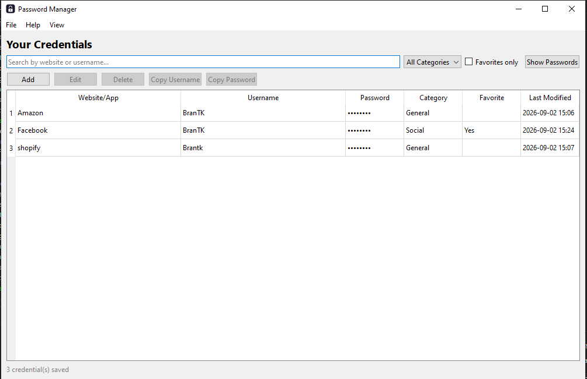
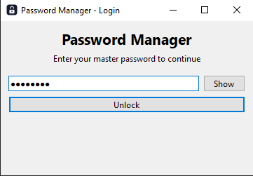
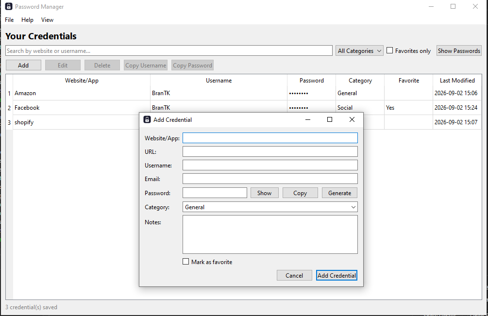
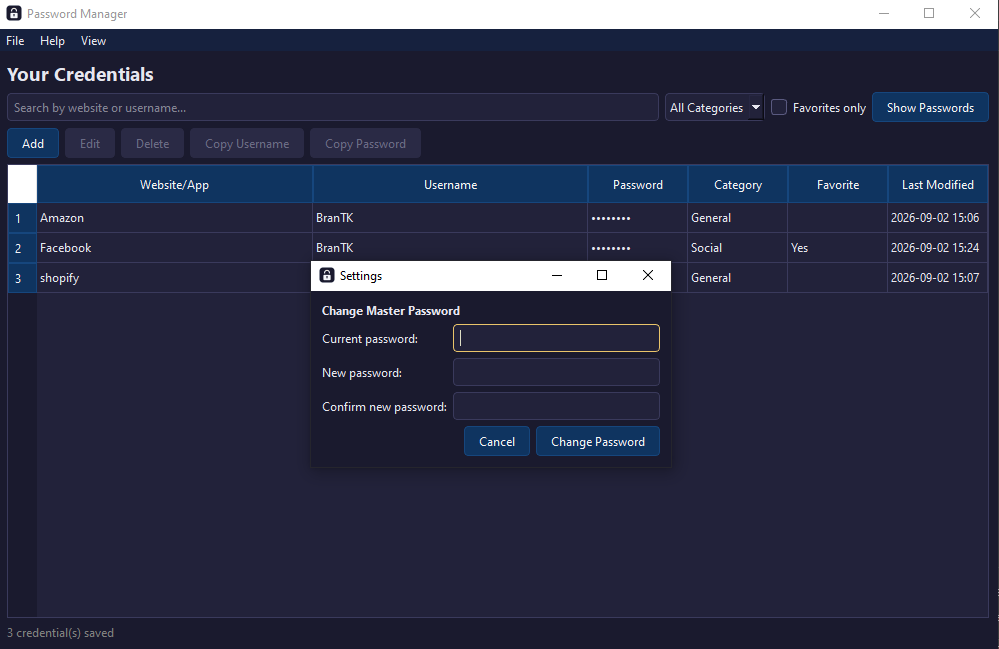

# Password Manager

A desktop password manager built in C++ with Qt Widgets. Store logins, website credentials, and secure notes behind a single master password, with every credential encrypted before it ever touches disk, no cloud, no accounts, everything stays local.

Built as a portfolio project to get hands-on with modern C++, object-oriented design, GUI development, applied cryptography, and a proper Git workflow.



## Features

- **Master password login** — a single password unlocks the vault; first launch walks you through creating one
- **Dashboard** — a live table of every saved credential, with a running count
- **Add / edit / delete credentials** — quick-entry dialog shared between add and edit, with a confirmation prompt before deleting
- **Search & filter** — search by website, username, or email; filter by category or favorites
- **Password generator** — adjustable length and character sets, live strength indicator, cryptographically random via OpenSSL
- **Copy to clipboard** — one click to copy a username or password without ever displaying it if you don't want to
- **Show/hide passwords** — masked by default, toggle to reveal
- **Favorites & secure notes** — mark frequently used logins, attach free-form notes to any entry
- **Change master password** — re-encrypts every stored credential under a freshly derived key
- **Auto-save** — every change writes to SQLite immediately, nothing to lose if you close the app mid-edit
- **Local, encrypted storage** — everything lives in a local SQLite database; passwords are AES-256-GCM ciphertext at rest, never plain text

## Tech Stack

- **C++17**
- **Qt 6** (Widgets + Sql)
- **SQLite** for local storage
- **OpenSSL** for cryptography (PBKDF2-HMAC-SHA256 key derivation, AES-256-GCM encryption)
- **CMake** for the build
- **Git / GitHub** for version control

## Architecture

```
include/                    Header files
  Credential.h                 Data model for a single stored login
  DatabaseManager.h              SQLite reads/writes, including master password salt/hash
  EncryptionManager.h              PBKDF2 key derivation + AES-256-GCM encrypt/decrypt
  LoginDialog.h                      Master password entry, handles first-run setup and login
  CredentialDialog.h                   Shared add/edit form for a single credential
  PasswordGeneratorDialog.h              Random password generation
  SettingsDialog.h                         Change master password
  AboutDialog.h                              App info
  MainWindow.h                                 Dashboard: table, search/filter, all CRUD actions

src/                        Implementation files (mirrors include/)

resources/                  Icons and stylesheets
database/                   vault.db lives here at runtime (gitignored, it's your data, not project code)
screenshots/                App screenshots for this README
docs/                       Additional documentation
```

The split follows a simple separation of concerns: `Credential` is a plain data model, `DatabaseManager` owns all SQLite reads/writes, `EncryptionManager` owns everything related to the master password (deriving keys, encrypting, decrypting, verifying), and `MainWindow` just wires the UI to those two and reacts to what the user does. Nothing in the UI layer touches SQL or crypto directly.

## Security Design

- The master password itself is **never stored**. Only a random salt and a verification hash (both derived via PBKDF2-HMAC-SHA256, 200,000 iterations) are persisted.
- On login, a fresh key is derived from the entered password and the stored salt, then compared against the stored hash before anything unlocks.
- Every credential password is encrypted individually with AES-256-GCM using a random IV each time, so encrypting the same password twice produces different ciphertext both times.
- GCM's authentication tag means tampered ciphertext fails to decrypt outright, rather than silently returning garbage.
- Changing the master password re-derives a new key, re-encrypts every stored credential with it, and only then overwrites the stored salt/hash.

## Building

**Requirements:**
- Qt 6 (Widgets and Sql modules)
- CMake 3.16+
- OpenSSL (`libssl-dev` on Linux; on Windows with MinGW, install via MSYS2: `pacman -S mingw-w64-x86_64-openssl`)
- A C++17-capable compiler (MSVC, MinGW, GCC, or Clang)

**Steps:**

1. Clone the repo
2. Open the folder in Qt Creator via `CMakeLists.txt`, or configure manually:
   ```
   cmake -B build -S .
   cmake --build build
   ```
3. Run the resulting `PasswordManager` executable

> On first launch, you'll be asked to create a master password (8+ characters). It can't be recovered if forgotten, there's no backdoor, that's the point.

## Data

Credentials are stored in `database/vault.db`, created automatically on first run. It's excluded from version control since it's personal data, not project code, so a fresh clone starts with an empty vault. Two tables live inside: `credentials` (your saved entries, passwords stored as encrypted ciphertext) and `app_settings` (the master password salt and verification hash only, never the password itself).

## Testing

Alongside the app, this project went through a round of standalone test programs (not shipped, used during development) covering: `Credential` validation logic, CRUD against real SQLite including persistence across a simulated restart, combined search/category/favorites filtering, full `EncryptionManager` correctness (round-trip encryption, key re-derivation after restart, wrong-password rejection, GCM tamper detection), a master-password-change flow verified end to end, password generator randomness, and a broad edge-case suite (empty vault, invalid ids, unicode/very long passwords, malformed ciphertext). A Valgrind pass across the suite came back with zero memory leaks and zero errors.

## Roadmap

- [x] Project setup, CMake build, basic UI
- [x] Login screen
- [x] Credential data model
- [x] CRUD operations
- [x] SQLite integration
- [x] Search & filter
- [x] Encryption (AES-256-GCM + PBKDF2)
- [x] Password generator, clipboard copy, show/hide, settings, about
- [x] Testing & cleanup
- [ ] Dark mode
- [ ] Cloud sync
- [ ] Browser extension

## Screenshots

**Login**


**Dashboard**


**Password Generator**


**Settings**


## License

This project is available for personal and educational use. Feel free to fork it and adapt it for your own portfolio.
